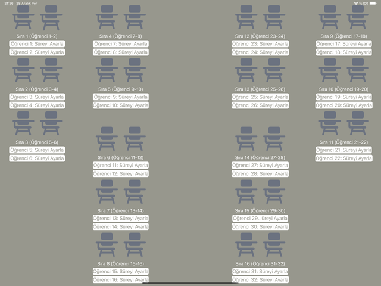

[![Swift Version][swift-image]][swift-url]
[![Platform][platform-image]][platform-url]
[![License: MIT][license-image]][license-url]

# StudentWatch
<br />
<p align="center">
  <a href="https://canduru.net">
    
  </a>
    <p align="center">
    This app created with Swift to iOS platform. User can start individual timers for each student, and monitor their times.
  </p>
</p>

StudentWatch (ships as **E-Monitor**) is an iPad app for exam invigilation. The single screen
lays out 16 desks with two seats each, so a proctor can hand a different amount of time to any
of 32 students, watch every countdown at a glance, and get an alert the moment a student's time
runs out. It is aimed at teachers and exam proctors who run individually timed or accommodated
exams in one room. The on-screen interface is in Turkish.

## Status

This application is currently in the development stage.

## Features

- [x] Start individual timer for total of 32 students
- [x] Monitor remaining time for each of the student
- [x] Per-student countdown: enter the exam length in minutes, the label counts down live
- [x] Alert dialog when a student's time is up, after which that seat resets to idle
- [x] Per-student reset button to stop and clear a running timer
- [x] Desks laid out as 16 tables of two seats, all visible on one iPad screen

## Tech Stack

- Swift 5.0, UIKit (fully programmatic views and Auto Layout, no main storyboard)
- `Timer.scheduledTimer` for the countdowns, `UIAlertController` for input and time-up alerts
- SF Symbols (`studentdesk`, `arrow.counterclockwise`) and an asset-catalog colour set
- No third-party dependencies: no CocoaPods, Carthage, or Swift Package Manager packages

## Requirements

- iOS 14.0+
- Xcode 15.1
- iPad (the app target is iPad-only, `TARGETED_DEVICE_FAMILY = 2`)

> **Building on a recent Xcode:** the project's deployment target is still iOS 14.0, which newer
> iOS SDKs no longer accept (Xcode 27 reports a supported range of 15.0+). Raise
> `IPHONEOS_DEPLOYMENT_TARGET` to 15.0 or later — in Xcode, or for a one-off build with
> `xcodebuild ... IPHONEOS_DEPLOYMENT_TARGET=15.0` — and the project compiles unchanged.

## Getting Started

```bash
git clone https://github.com/CanDuru4/StudentWatch.git
open StudentWatch/StudentWatch.xcodeproj
```

Then, in Xcode:

1. Select the **StudentWatch** scheme and an iPad simulator (or a connected iPad).
2. Under **Signing & Capabilities**, replace the checked-in development team with your own
   Apple Developer team and, if you plan to run on a device, change the bundle identifier
   (`com.CanDuru.StudentWatch`) to one you own.
3. Press **Run** (`Cmd+R`).

No API keys, `.env` file, or environment variables are required — the app is entirely offline
and stores nothing outside the running process.

#### CocoaPods
No pods are required for the current version of project.

## Project Structure

```
StudentWatch/
├── StudentWatch/
│   ├── AppDelegate.swift              # App lifecycle, scene configuration
│   ├── SceneDelegate.swift            # Builds the window, sets ClassViewController as root
│   ├── ClassOneViewController.swift   # The whole classroom screen: 32 timers, layout, actions
│   ├── Assets.xcassets/               # App icon and the AppColor1-3 colour sets
│   ├── Base.lproj/LaunchScreen.storyboard
│   └── Info.plist
├── StudentWatchTests/                 # XCTest target (Xcode template stubs, no tests yet)
├── StudentWatchUITests/               # XCUITest target (Xcode template stubs, no tests yet)
├── docs/assets/                       # README images
└── StudentWatch.xcodeproj/
```

## Photos from Application

<p align="center">

</p>

## License

Released under the [MIT License](LICENSE). Copyright (c) 2023-2026 Can Duru.

## Meta

Can Duru – https://canduru.net – canduru2004@gmail.com, support@canduru.net

[https://github.com/CanDuru4](https://github.com/CanDuru4)

[swift-image]:https://img.shields.io/badge/swift-5.0-orange.svg
[swift-url]: https://swift.org/
[platform-image]: https://img.shields.io/badge/platform-iPadOS%2014.0%2B-lightgrey.svg
[platform-url]: https://developer.apple.com/ipados/
[license-image]: https://img.shields.io/badge/license-MIT-blue.svg
[license-url]: LICENSE
